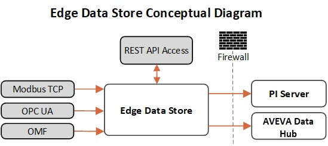
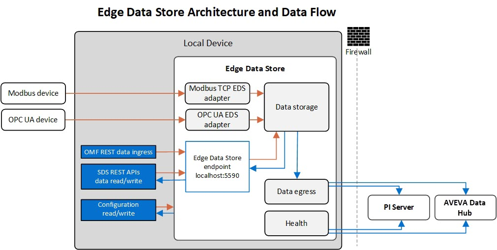

# Edge Data Store

Edge Data Store (EDS) is a lightweight data collection and storage application designed to capture data at the edge of networks for historical storage and analysis. It runs on small, rugged devices or embedded in existing industrial hardware and is designed to be resilient and require minimal installation and administration. While not a replacement for a PI System or AVEVA Data Hub, EDS augments the PI System and AVEVA Data Hub by collecting and storing data in situations where deploying a full system is impractical.

The following diagram shows conceptually how EDS captures data and sends to permanent storage:

EDS collects data using any of the following methods:

* Built-in OPC UA connectivity

* Built-in Modbus TCP connectivity

* Custom application using OSIsoft Message Format (OMF)

* Custom application using REST API

Once collected, EDS stores the data locally in configurable data storage until it can be sent to permanent storage in a PI System or in AVEVA Data Hub through periodic egress. The data can also be read from local storage by custom applications that use REST APIs.

## Edge Data Store architecture

EDS runs on both Linux and Windows platforms and is comprised of separate components that each perform a specific function within EDS. The following diagram shows Edge Data Store architecture with all of its components and how the data flow through those components:

EDS components are shown in grey within the Edge Data Store in the diagram:

* Modbus TCP EDS adapter – Collects data from Modbus TCP devices and writes it to data storage

* OPC UA EDS adapter – Collects data from OPC UA devices and writes it to data storage

* Data Storage – Stores data locally until it can be egressed

* Data egress – Sends data from storage to PI Server or AVEVA Data Hub

  **Note:** EDS also supports OSIsoft Cloud Services as an egress destination.

* Health – Records health information of components and sends it to PI Server or AVEVA Data Hub

Blue boxes in the diagram show ways to interact with EDS from the local device:

* OMF REST – Use OSIsoft Message Format to write data to the data storage component programmatically

* SDS REST APIs – Use SDS REST APIs to read data from and write data to the data storage component programmatically

* Configuration – Use REST or the EdgeCmd tool to configure EDS as a whole or each component individually and to view the current configuration

EDS requires an endpoint to connect to REST APIs on the local device, which is shown outlined in blue in the diagram. By default, the endpoint uses port `5590`; however, you can configure it to use another port.

Orange arrows show data flowing into EDS and blue arrows show data flowing out of EDS.

For detailed information about configuring each component of EDS, see [Configuration](xref:Configuration).
