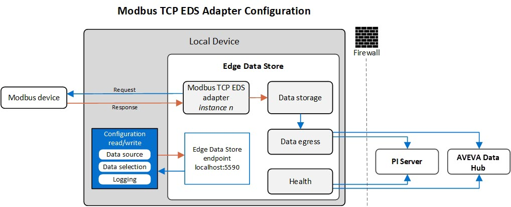

# Modbus TCP EDS adapter

The Modbus TCP EDS adapter is a component of Edge Data Store that transfers time-series data from a device to EDS. Modbus TCP is a commonly available communication protocol used for connecting and transmitting information between industrial electronic devices. The Modbus TCP EDS adapter can communicate with any device conforming to the Modbus TCP/IP protocol through a gateway or router; devices and routers do not need to be on the same subnet as Edge Data Store.

The following diagram depicts the data flow of a single instance of Modbus TCP EDS adapter:

The adapter instance requests data from the Modbus TCP device and then the device sends its data. The adapter sends the collected data to the storage component where it is held until it can be egressed to permanent storage in PI Server or AVEVA Data Hub. You can configure the adapter instance from the device where EDS is installed and EDS collects health information about the adapter that can be egressed.

The Modbus TCP EDS adapter can connect to multiple devices by defining one instance of the adapter for each device. The EDS installation includes the Modbus TCP EDS adapter and the option to add a single Modbus TCP EDS adapter instance. Add additional instances after installation using system components configuration.

Once an adapter instance is defined, manually configure it with JSON documents that specify the following:

  - Data source configuration - identifies the device from which the data originates, specifies the security for the connection, and controls how the data streams from that device identified. Each adapter component instance requires a data source configuration.
  
  - Data selection configuration - specifies what data is collected from the device and how it is identified. Each adapter component instance requires a data selection configuration.
  
With these configurations completed, the Modbus TCP EDS adapter polls devices to capture data, at the rate specified in the configuration and sends it to EDS, where it is stored locally until it can be sent to a PI System or AVEVA Data Hub for long-term storage and analysis.
