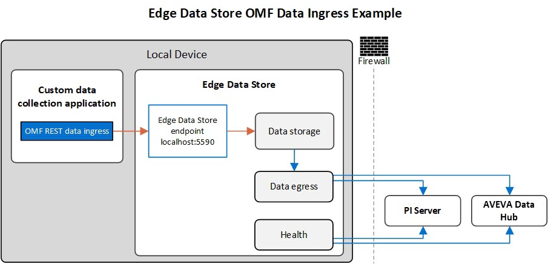

# OSIsoft Message Format

Create a custom application using OSIsoft Message Format (OMF) to send data to EDS from sources that cannot use Modbus or OPC UA protocols. The following diagram depicts the data flow from an OMF data collection application into EDS:



The OMF application collects data from a data source and sends it to the Edge Data Store endpoint. The EDS endpoint sends the data to the storage component where it is held until it can be egressed to permanent storage in PI Server or AVEVA Data Hub. The OMF application must run on the same device as Edge Data Store and no authentication is needed.

## OMF endpoint

The route to the OMF endpoint to the Edge Storage component is shown below. Replace `<port_number>` with the port configured for your EDS system:

```http
Method: POST
Endpoint: http://localhost:<port_number>/api/v1/tenants/default/namespaces/default/omf
```

This endpoint can only be accessed locally, so the OMF application must run on the same device as EDS.

## Supported functionality

Edge Data Store supports OMF versions 1.0, 1.1, and 1.2 for data ingress. For details on the difference versions of OMF, see the OMF specification, available here: [OSIsoft Message Format](https://docs.osisoft.com/bundle/omf/page/index.html). The OMF ingress functionality is the same technology that is used in AVEVA Data Hub and writing an OMF application for EDS is very similar to writing an OMF application for AVEVA Data Hub.

The OMF endpoint for the Edge Storage component only supports the create action; it does not support the update action. If a create data message is sent with the same time index, the values will be replaced at that index value.

Dynamic messages are supported, but static messages (usually used for creating PI AF assets) are not supported by EDS. Any static OMF messages sent to the EDS OMF REST endpoint will be ignored.

For efficiency reasons, OSIsoft recommends batching OMF messages that are sent to the EDS endpoint. Sending single messages or a small number of messages to the OMF endpoint can be successful, but it is inefficient. When a single message or a small number of messages are sent at a time, the HTTP overhead of creating the request and processing the response on a small device requires more system resources than the processing of the OMF message itself. While a large number of OMF messages per second can be processed by EDS platforms, OSIsoft recommends keeping the number of HTTP calls per second low to increase efficiency.
