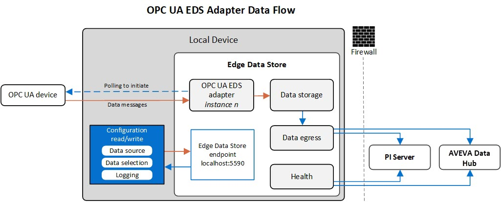

# OPC UA EDS adapter

## Overview

The OPC UA EDS adapter is a component of Edge Data Store that transfers time-series data from an OPC UA capable device to EDS. OPC Unified Architecture (OPC UA) is a machine to machine communication protocol for industrial automation developed by the OPC Foundation. The OPC UA EDS adapter can connect to any device that uses the OPC UA communication protocol, and it uses subscriptions to reduce the amount of data transferred by only reading data changes and events.

The following diagram depicts the data flow for a single instance of OPC UA EDS adapter instance:

The adapter instance polls the OPC UA device and then collects data from the device. The adapter then sends the data to the storage component where it is held until it can be egressed to permanent storage in AVEVA Server or AVEVA Data Hub. You can configure the adapter instance from the device where EDS is installed. EDS also collects health information about the adapter that can be egressed.

The OPC UA EDS adapter can connect to multiple devices by defining one instance of the adapter for each device. The EDS installation includes the OPC UA EDS adapter and the option to add a single OPC UA EDS adapter instance. Add additional instances after installation using system components configuration.

Once an adapter instance is defined, manually configure it with JSON documents that specify the following:

  * Data source configuration - identifies the device from which the data originates, specifies the security for the connection, and controls how the data streams from that device identified. Each adapter component instance requires a data source configuration.
  
  * Data selection configuration - specifies what data is collected from the device and how it is identified. Each adapter component instance requires a data selection configuration.

With these configurations completed, the OPC UA EDS adapter instance collects data from the specified device and sends it to EDS, where it is stored locally until it can be sent to a PI System or AVEVA Data Hub for long-term storage and analysis.
